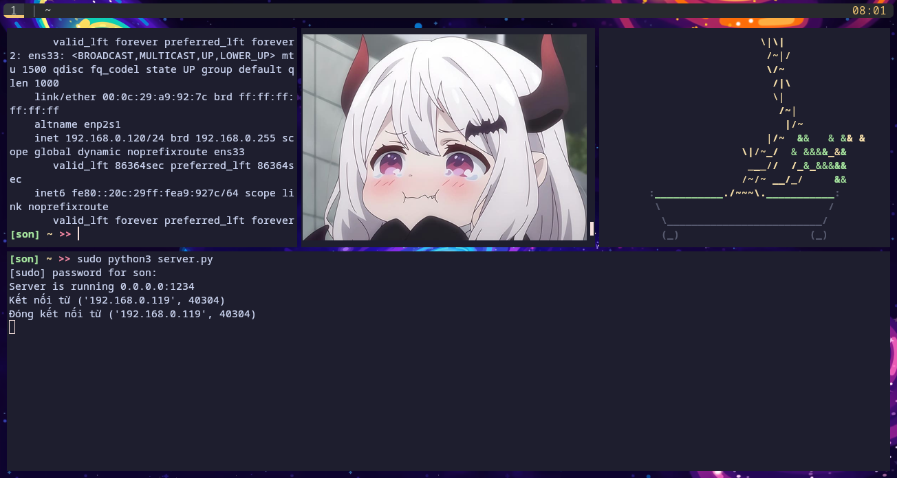

Để khởi tạo server dùng lệnh: sudo python3 server.py

Mở 1 terminal khác (hoặc thiết bị khác) dùng netcat để lấy reverse shell
Nếu là terminal khác thay IP bằng 127.0.0.1 

LƯU Ý: Mỗi khi gõ 1 lệnh gì, cần enter 2 lần để lấy kết quả

Để hack thành công, lệnh whoami phải trả về root

